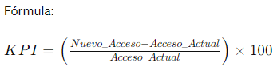
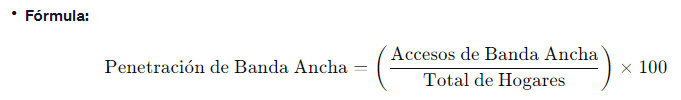
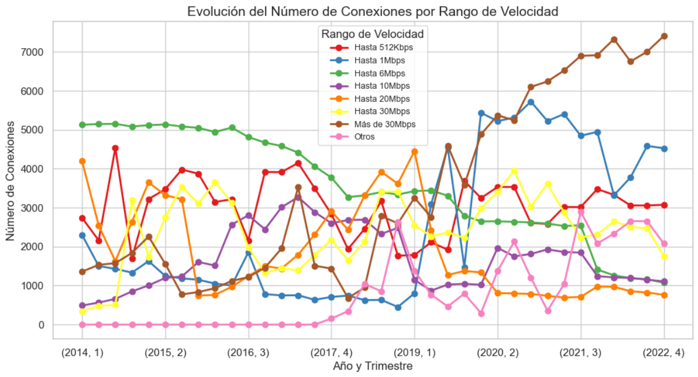
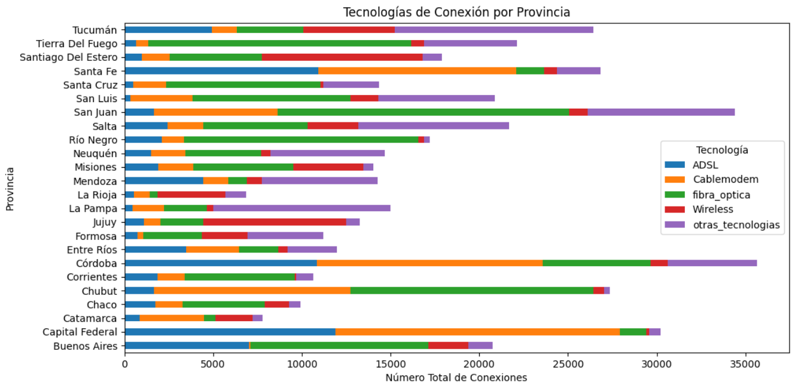

# ANÁLISIS DE DATOS: SERVICIO DE INTERNET EN ARGENTINA

---

<!-- Image -->

    

## **INTRODUCCIÓN**

---

Bienvenido al proyecto de Análisis de Datos sobre el Servicio de Internet en Argentina. En un mundo cada vez más interconectado, las telecomunicaciones desempeñan un papel crucial, facilitando la transmisión de información a nivel global. En este contexto, el internet emerge como una red transformadora, influyendo en cómo vivimos, trabajamos y nos relacionamos.

En este contexto, datos oficiales recientes muestran que Argentina tuvo un crecimiento sostenido en el número de conexiones a Internet: en el último trimestre de 2022 alcanzó el récord provincial de 11.208.114 conexiones a la red, una marca que representa un incremento de 17% respecto de igual trimestre de 2020.

Descubre con nosotros cómo la conectividad ha evolucionado en Argentina, explorando visualizaciones interactivas, tendencias temporales y recomendaciones para mejorar la experiencia de Internet en este vibrante país sudamericano. ¡Prepárate para un viaje a través de los datos que impulsan la transformación digital en Argentina!

## **OBJETIVO**

---

El objetivo principal de este proyecto de análisis de datos es comprender y mejorar la conectividad digital en Argentina, centrándose en dos aspectos clave: la penetración de banda ancha en hogares y la velocidad de descarga en accesos de fibra óptica. Buscamos identificar áreas de oportunidad y proponer acciones específicas para optimizar la experiencia de Internet en todo el país.

## **ESTRUCTURA DE CARPETAS**

---

- [**Assets**:](./Assets/) Directorio que incluye los recursos visuales necesarios (imágenes principalmente).
- [**Datasets**:](./Datasets/) Directorio donde se disponibilizan las fuentes de datos. Son todos archivos csv.
- [**Notebooks**:](./Notebooks/) Informe de Análisis exploratorio de datos (ETL & EDA) y modelado necesario para llevar a cabo el reporte.
- [**Dashboard**:](./Dashboard-DA_Telecom.pbix) Reporte intercativo realizado en Power BI de Microsoft que refleja todo el análisis.

## **REQUISITOS**

---

Para ejecutar y replicar este proyecto de análisis de datos sobre el servicio de Internet en Argentina, necesitarás tener instalados los siguientes elementos en tu entorno de desarrollo: 

- Python y Jupyter Notebooks: 
  Puedes instalarlos utilizando Anaconda, que proporciona una distribución de Python y Jupyter preconfigurada. 
  _pip install notebook pandas numpy matplotlib seaborn_

- Power BI Desktop: 
  Descarga e instala Power BI Desktop, la herramienta de visualización de datos utilizada para crear el dashboard interactivo.

- Power BI Service (opcional):
  Si deseas compartir el dashboard en línea, crea una cuenta en Power BI Service, donde podrás publicar y compartir informes y dashboards.

- Datos:
  Los datos utilizados en este proyecto están disponibles en la carpeta [**Datasets**](./Datasets/). Asegúrate de descargar o tener acceso a los conjuntos de datos necesarios.

## **DATOS**

---

Los datos utilizados en este proyecto se obtuvieron principalmente del portal de datos abiertos de la ENACOM (Ente Nacional de Comunicaciones) de Argentina. Puedes acceder al conjunto de datos en [ENACOM - Acceso a Internet](https://datosabiertos.enacom.gob.ar/dashboards/20000/acceso-a-internet/).

**Pasos para obtener los datos:**

1. Visita el enlace proporcionado: [ENACOM - Acceso a Internet](https://datosabiertos.enacom.gob.ar/dashboards/20000/acceso-a-internet/).

2. Explora el portal y selecciona la sección o conjunto de datos relevante para el análisis de conectividad digital en Argentina.

3. Descarga los archivos de datos necesarios. Generalmente, encontrarás opciones para descargar datos en formatos comunes como CSV o Excel.

4. Guarda los archivos descargados en la carpeta [**Datasets**](./Datasets/) de este proyecto.

Asegúrate de tener los archivos de datos necesarios antes de ejecutar los Jupyter Notebooks o utilizar el dashboard en Power BI. Esta estructura facilita el manejo y la replicación del análisis con los conjuntos de datos originales.

## **ETAPAS DEL PROYECTO**

---

### **1) ETL [(Extract, Transform and Load)](./Notebooks/ETL.ipynb)**

Extrajimos los datos en formato .csv desde la página oficial de ENACOM. Estos datos formaron la base esencial para nuestro análisis.

Posteriormente, nos sumergimos en la fase de transformación de datos, crucial para depurar y organizar los datasets seleccionados. Durante este proceso, se hizo una unión de los datasets, tomando como referencia las columnas 'Año', 'Trimestre' y 'Provincia'.

Se eliminaron las columnas de totales al ser columnas calculadas de las que podemos prescindir. Asimismo, aquellas columnas que contenían valores nulos en todos los registros. Renombramos algunas columnas de acuerdo a la nomenclatura 'Snake Case' para facilitar su entendimiento, también se convirtieron los tipos de datos de algunas columnas.

Finalmente se cargó o guardó la data resultante en el archivo [Internet_limpio.csv](./Datasets/Internet_limpio.csv)

### **2) EDA [(Exploratory Data Analysis)](./Notebooks/EDA.ipynb)**

En esta etapa se realizó el análisis que proporciona una visión integral de los datos, destacando tendencias, variaciones y relaciones importantes en el contexto de los accesos a servicios de Internet en Argentina.

En el archivo de [**EDA**:](./Notebooks/EDA.ipynb) se mencionan los pasos realizados para analizar los datos y las correlaciones de las diferentes variables. Se utilizaron algunos scripts de Python para la Descripción de los datos, Análisis de Nulos y Outliers, EDA de Variables Categóricas, EDA de Variables Numéricas y Generación de Insights.

### **3) Construcción del Dashboard**

Principalmente se ha tenido en cuenta 2 objetivos de análisis, basados en los siguientes KPI:

- **KPI 1:Aumentar en un 2% el acceso al servicio de internet para el próximo trimestre, cada 100 hogares, por provincia.** 
  . Objetivo: Aumentar la accesibilidad al servicio de Internet en cada provincia, buscando un incremento del 2% en la penetración de Internet por cada 100 hogares para el próximo trimestre. 
  . Indicador Numérico: Porcentaje de aumento en la penetración de Internet por cada 100 hogares. 
  . Plazo: Próximo trimestre. 
  . Meta: Lograr un aumento del 2% en la penetración de Internet por cada 100 hogares en todas las provincias para el final del próximo trimestre. 

    

- **KPI 2: Penetración de Banda Ancha en Hogares en la Provincia de Buenos Aires** 
  . Objetivo: Aumentar la penetración de banda ancha en hogares en la provincia de Buenos Aires. 
  . Indicador Numérico: Porcentaje de accesos de banda ancha por cada 100 hogares. 
  . Plazo: Próxima revisión trimestral. 
  . Meta: Aumentar la penetración en un 10% en el próximo año fiscal. 

    

### **4) ALGUNOS RESULTADOS**

**Tendencias en el Número de Accesos por cada 100 Hogares por Año y Provincia** 
El siguiente gráfico nos permite analizar las tendencias en el número de accesos de hogares a lo largo de los años para cada provincia. Proporciona información sobre cómo ha cambiado el número de accesos de hogares con el tiempo y si hay variaciones entre provincias.

    

**Evolución del Número de Conexiones por Rango de Velocidad** 
En el siguiente gráfico se puede observar lo siguiente:

1. Cambio en Conexiones de Alta Velocidad en Argentina:
   Destaca un cambio significativo en la categoría de "+30 Mbps" a partir de 2018, con un crecimiento constante trimestral. Indica una tendencia ascendente en la adopción de conexiones de alta velocidad, posiblemente debido a la creciente demanda de servicios que requieren mayores capacidades.

2. Disminución en Velocidades de 1 a 6 Mbps:
   Se observa una disminución constante en las conexiones en el rango de "+1 Mbps - 6 Mbps," sugiriendo una tendencia a la baja en el uso de velocidades inferiores a 6 Mbps con el tiempo. Esto podría reflejar la creciente demanda de servicios que requieren velocidades más altas.

    

**Tecnologías de Conexión por Provincia** 
Del siguiente gráfico se observa las Provincias con el mayor número de conexiones para cada tecnología: 

- ADSL --> Capital Federal 
- Cablemodem --> Capital Federal 
- Fibra_optica --> San Juan 
- Wireless --> Santiago del Estero 
- Otras_tecnologias --> Tucumán 

    

### **5) CONCLUSIONES**

Este proyecto de Análisis de Datos sobre el Servicio de Internet en Argentina ha proporcionado una visión profunda de la conectividad digital en el país. A través de datos oficiales recientes, hemos observado un crecimiento significativo en el número de conexiones a Internet, alcanzando un récord provincial de 11,208,114 conexiones en el último trimestre de 2022. Este logro representa un aumento del 17% en comparación con el mismo trimestre de 2020.

**Principales Hallazgos:**

- Argentina experimenta un crecimiento sostenido en la adopción de Internet, indicando una mayor dependencia y participación en la era digital.
- La provincia de Buenos Aires destaca con un aumento notable en la penetración de banda ancha en hogares, reflejando una mejora en la accesibilidad a servicios de alta velocidad.

**Logros del Proyecto:**

1. Realizamos un proceso ETL exhaustivo, extrayendo datos de fuentes confiables de ENACOM y llevándolos a un formato limpio y organizado.
2. Condujimos un Análisis Exploratorio de Datos (EDA) detallado, identificando correlaciones clave y tendencias significativas.
3. Construimos un Dashboard interactivo utilizando Power BI, que refleja visualmente los resultados del análisis y proporciona una herramienta valiosa para la toma de decisiones.

**KPIs y Objetivos:**

- Implementamos KPIs específicos, como el objetivo de aumentar en un 2% el acceso a Internet por cada 100 hogares en todas las provincias para el próximo trimestre. Establecimos indicadores numéricos, plazos y metas claras para medir nuestro progreso.

**Resultados Clave:**

- Identificamos áreas de oportunidad para mejorar la conectividad, destacando la importancia de acciones específicas en la provincia de Buenos Aires.
- El Dashboard proporciona una herramienta efectiva para monitorear y evaluar el progreso hacia los objetivos establecidos.

**Impacto Potencial:**

- El análisis realizado y las recomendaciones propuestas tienen el potencial de impactar positivamente en la calidad y accesibilidad de los servicios de Internet en Argentina, contribuyendo al desarrollo digital del país.

**Lecciones Aprendidas:**

- La combinación de herramientas como Power BI y Python (Pandas) demostró ser efectiva para un análisis integral.
- La importancia de la visualización de datos en la comunicación de resultados y recomendaciones.

Este proyecto representa un paso significativo hacia la comprensión y mejora de la conectividad digital en Argentina, sentando las bases para futuras iniciativas y decisiones informadas en el ámbito de las telecomunicaciones y la transformación digital.

## **STACK TECNOLÓGICO**

---

        

## REFERENCIAS

---

https://contactcentersonline.com/argentina-las-conexiones-a-internet-crecieron-17-en-dos-anos/ 
https://www.lanacion.com.ar/tecnologia/el-85-de-los-hogares-argentinos-cuentan-con-conexion-fija-a-internet-vos-tenes-la-misma-velocidad-en-nid02102023/
